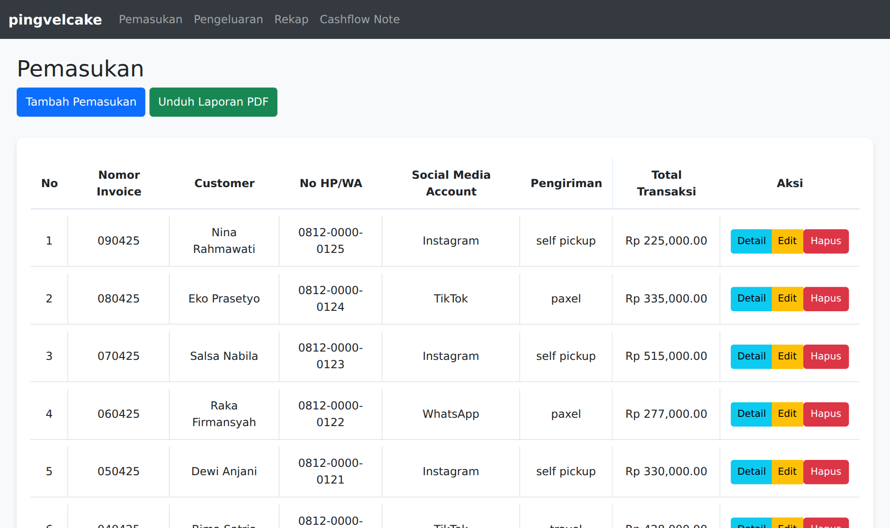
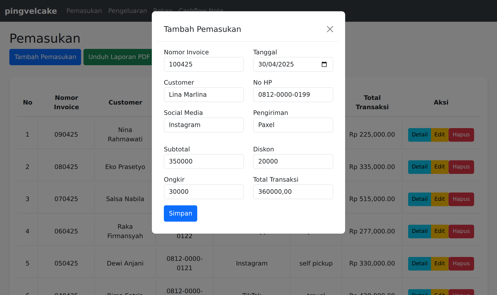
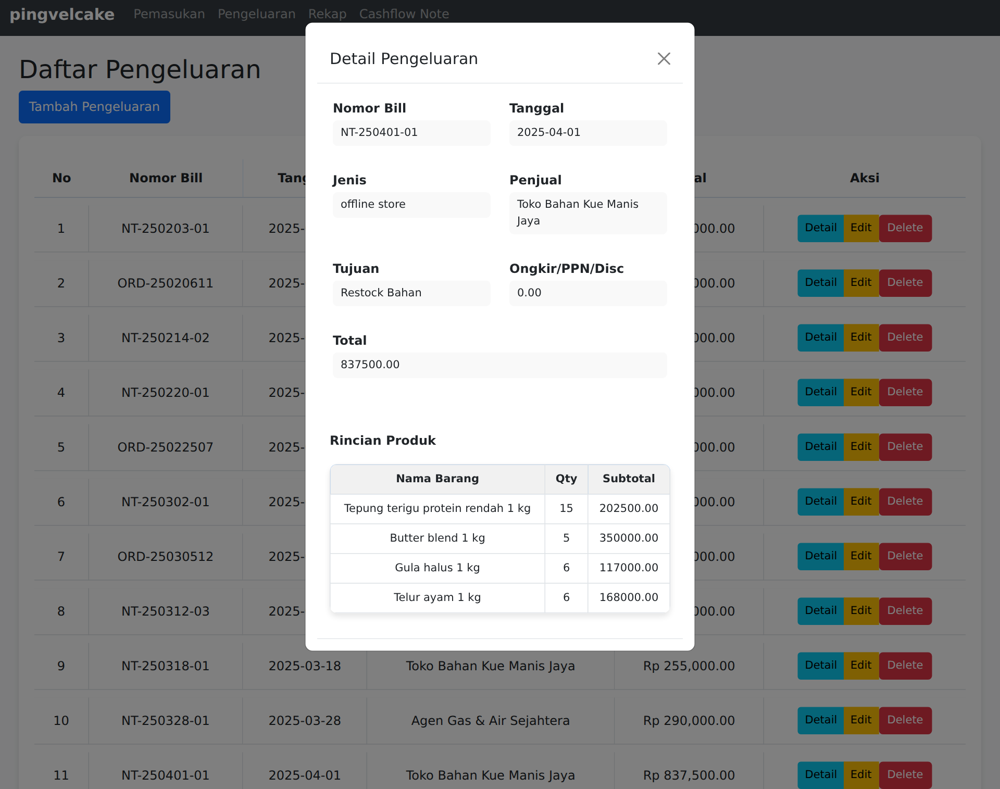
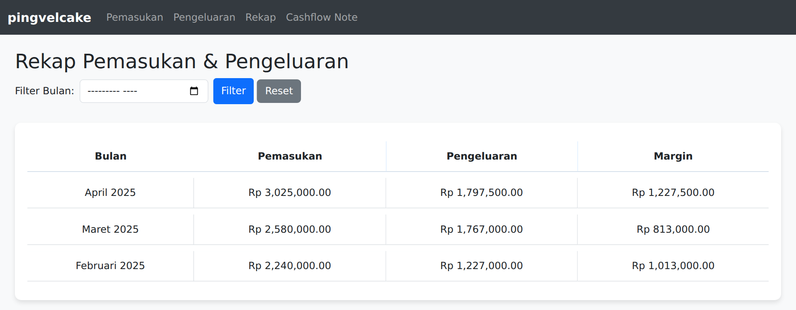
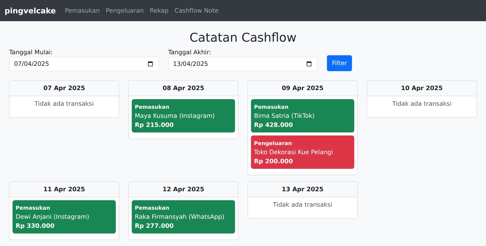

# Pingvel Cake – Sistem Pencatatan Keuangan

Aplikasi web untuk mencatat keuangan usaha kue Pingvel Cake: penjualan (pemasukan), pembelian dan biaya (pengeluaran), rekap bulanan, serta catatan arus kas. Dibangun dengan Laravel 12 dan MySQL.

> Semua data pada screenshot di bawah adalah **data fiktif** untuk keperluan demo.

## Tampilan



| Form pemasukan: nomor invoice & total terisi otomatis | Detail pengeluaran beserta rincian barang |
| --- | --- |
|  |  |

| Rekap bulanan | Catatan arus kas mingguan |
| --- | --- |
|  |  |

## Fitur

**Pemasukan (penjualan)**
- Nomor invoice otomatis berurutan per bulan dengan format `NNBBTT` (contoh: `030425` = invoice ke-3 bulan April 2025).
- Total transaksi dihitung otomatis: subtotal − diskon + ongkir.
- Pencatatan pelanggan, kanal pemesanan, dan metode pengiriman, termasuk jadwal pickup untuk pesanan self-pickup.
- Laporan pemasukan yang bisa diunduh dalam format PDF.

**Pengeluaran (pembelian & biaya)**
- Pencatatan nota dari e-commerce maupun toko offline.
- Klasifikasi ke 10 pos biaya: Restock Bahan, Restock Packaging, Restock Decorative, Pengadaan, RnD, Promote, WFC, Reward Staf, Diskon Pelanggan, dan Operasional.
- Rincian barang per nota (nama barang, qty, subtotal); total nota dihitung ulang otomatis dari rinciannya.

**Rekap bulanan**
- Total pemasukan, pengeluaran, dan margin setiap bulan, lengkap dengan filter bulan.

**Catatan arus kas**
- Transaksi masuk (hijau) dan keluar (merah) per hari untuk rentang tanggal yang dipilih.

## Teknologi

Laravel 12 (PHP 8.2+) · MySQL/MariaDB · Blade + Bootstrap 5 · JavaScript (Fetch API) · DomPDF · Laravel Excel

## Menjalankan secara lokal

Prasyarat: PHP 8.2+, Composer, dan MySQL/MariaDB.

```bash
git clone https://github.com/<username>/sistem-keuangan-pingvelcake.git
cd sistem-keuangan-pingvelcake
composer install
cp .env.example .env
php artisan key:generate
```

Buat database kosong bernama `pingvelcake`, sesuaikan `DB_USERNAME` dan `DB_PASSWORD` di file `.env`, lalu jalankan:

```bash
php artisan migrate
php artisan serve
```

Aplikasi bisa dibuka di http://localhost:8000.

> Menu Rekap memakai fungsi `DATE_FORMAT` milik MySQL, jadi gunakan MySQL/MariaDB (bukan SQLite).

## Pengembangan selanjutnya

- Menambahkan login dan hak akses pengguna.
- Menyamakan dasar perhitungan pemasukan antara menu Rekap (subtotal) dan Catatan Arus Kas (total transaksi).
- Merapikan format ekspor Excel arus kas, lalu mengaktifkan kembali tombolnya.
- Menampilkan pesan galat yang tepat ketika penyimpanan pengeluaran gagal.

## Pembuat

**Maylani Rahma Purwanti** · [LinkedIn](https://www.linkedin.com/in/maylanirahmap)
